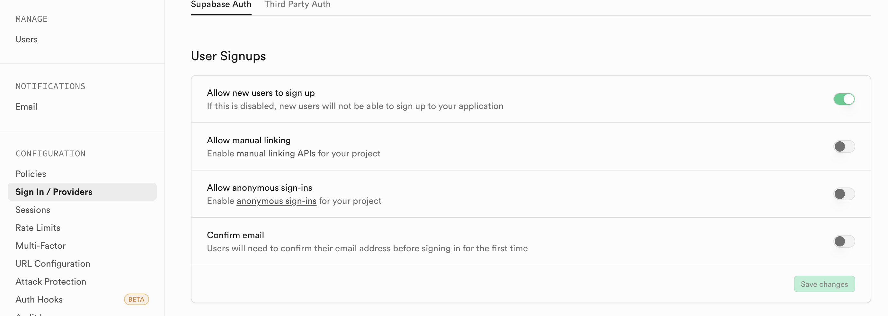

<h1>Content OS monorepo</h1>

- [What is it for](#what-is-it-for)
- [Architecture](#architecture)
- [Prerequisites](#prerequisites)
- [Quickstart](#quickstart)
- [Backend Setup](#backend-setup)
- [Frontend Setup](#frontend-setup)
- [Vercel deployment](#vercel-deployment)
- [Role-Based Access Control (RBAC)](#role-based-access-control-rbac)
- [Security Guidelines](#security-guidelines)
- [License](#license)


## To Do - Template

- Finish Creating Google OAuth Credentials (configure oauth in production)
- Permission Abstraction /Billing service and integration test
- GoogleAnalytics
- check new data loaded whenever the route changes
- Vs comparison/ company/sitemap pages in Footer
- Cookie Consent not show (scroll)
- seed
- doc subdomain
- check rate limit again

## To Do - Specifix

- Add open graph image
- landing page
- limit how many workspaces can be created for different plans


## What Is It For

The features include:

- RBAC Access control
- Refresh Token
- Work space with team invitation System
- One-time Payment & Subscription Management System
- Blog with admin system (Optimized for SEO) 
- Dark Theme Support


## Architecture

### Tech Stack

- Supabase DB & Auth
- Express.js
- Svelte 5
- Tailwind CSS
- DaisyUI
- Redis
- Stripe
- Resend
- Sentry
- Vercel


## Prerequisites

- Node.js 24.x or higher
- **Corepack** (for the correct pnpm version and to avoid Node's `url.parse` deprecation warning during install): enable with `corepack enable`. The repo pins `pnpm@10.30.3` via the `packageManager` field so installs use a pnpm version that no longer triggers DEP0169.
- Supabase account

```bash
nvm use 24.14.0
corepack enable
```


## Quickstart

1. Clone the repository

2. Install dependencies (use **pnpm** only; npm/yarn are blocked to avoid mixed installs):

```bash
pnpm install
```

3. Set up environment variabless

- [backend](https://github.com/Ratimon/saas-template-monorepo?tab=readme-ov-file#1-environment-variables-setup-for-backend)
- [web](https://github.com/Ratimon/saas-template-monorepo?tab=readme-ov-file#1-environment-variables-setup-for-web)

### For Backend Local Development

```bash
cd /backend
```

```bash
pnpm dev
```

```bash
pnpm test:unit
pnpm test:integration
pnpm test:e2e
pnpm test:webhook
```

```bash
pnpm db:aggregate-migrations-all
pnpm db:production:typegen
pnpm db:production:push-db
```

### For Frontend Local Development

```bash
cd /web
```

```bash
pnpm dev
```

```bash
pnpm test:unit
```

```bash
npm run preview
```


### For Deployment

```bash
pnpm build:js
```

```bash
pnpm vercel:deploy:backend
```

```bash
pnpm ercel:deploy:web
```


## Backend Setup

### 1. Environment Variables Setup for Backend

- At **./backend** create a `.env.develpment.local` (by renaming `.env.developmnet.local.example`) file in the root of your project. This file will store all the environment variables needed for your project. Do the same for `production` convention
- in your local dev environment, leave `NODE_ENV` as development and when deploying, change to production:

```bash
NODE_ENV=development
FRONTEND_DOMAIN_URL=http://localhost:5173
```

### 1.1 `Supabase`

- Create a free account at Supabase and a new project: Remember the Database Password. We may need it later.
- Go to Setting -> either Data API , API Keys , JWT Keys

```sh
# SUPABASE - DATABASE
PUBLIC_SUPABASE_URL=
PUBLIC_SUPABASE_ANON_KEY=
SUPABASE_SERVICE_ROLE_KEY=
```

### 1.2 `Redis`

- Create an account at [redis](https://cloud.redis.io/) and then add an database

```sh
# Cache:Redis

# retrieve REDIS_HOST from Public endpoint : `redis-*****18904.*.ap-southeast-1-1.ec2.cloud.redislabs.com`
REDIS_HOST=
# retrieve REDIS_HOST from Public endpoint : 18903
REDIS_PORT=18903
#  GO to security panel
REDIS_PASSWORD=
REDIS_DB=0
REDIS_PREFIX=app:cache:
REDIS_MAX_RECONNECT_ATTEMPTS=10
REDIS_ENABLE_OFFLINE_QUEUE=true
REDIS_USE_SCAN=true
```

### 1.3 Sentry (optional)

To enable error monitoring, set `SENTRY_DSN` in your env (get the DSN from [sentry.io](https://sentry.io) → Project Settings → SDK Setup -> Client Keys). If unset, Sentry is disabled.

```sh
# SENTRY
SENTRY_DSN=
SENTRY_ENABLED=true
```

### 1.4 Google OAuth (optional)

- **Goal**: enable Google social login via the backend OAuth endpoints.
- **Backend endpoints**:
  - Start login (returns redirect URL): `GET /api/v1/auth/oauth/google`
  - Callback (Google redirects here): `GET /api/v1/auth/oauth/google/callback?code=...`
- **Google Console setup**:
  - Create OAuth client credentials (Web application).
  - Add **Authorized redirect URI**:

```sh
${BACKEND_DOMAIN_URL}${API_PREFIX}/auth/oauth/google/callback
```

- **Environment variables** (in `backend/.env.development.local`):

```sh
# Google OAuth
OAUTH_GOOGLE_CLIENT_ID=
OAUTH_GOOGLE_CLIENT_SECRET=

# These must match how the redirect URI above is constructed
BACKEND_DOMAIN_URL=http://localhost:3000
API_PREFIX=/api/v1
```

- **Notes**:
  - The callback ultimately redirects to the frontend callback page: `${FRONTEND_DOMAIN_URL}/auth/callback`.
  - If Google OAuth is not configured, the backend will treat the provider as disabled.

### 2. Database Setup

- Install Supabase CLI
- modify `project_id` in [config.toml](./backend/supabase/config.toml)

```toml
# A string used to distinguish different Supabase projects on the same host. Defaults to the
# working directory name when running `supabase init`.
project_id = "content-os"
```

- **Migration aggregation** — Combine SQL from `backend/supabase/db/` into `backend/supabase/migrations/`:
  - **All modules** (one file, clears existing migrations):
    ```sh
    pnpm db:aggregate-migrations-all
    ```
    Output: `YYYYMMDD_core_structure.sql`
  - **Single module** (one file, does not clear other migrations):
    ```sh
    pnpm db:aggregate-migrations-single <module-name>
    ```
    Example: `pnpm db:aggregate-migrations-single config` → `YYYYMMDD_config.sql`

- **Cron: expired refresh tokens** — The `user-auth` module includes a cron job that deletes expired rows in `public.refresh_tokens` (runs every Saturday at 3:30 AM GMT). It uses the `pg_cron` extension. On **Supabase Cloud**, enable `pg_cron` first via [Dashboard → Integrations → Cron](https://supabase.com/dashboard/project/_/integrations/cron/overview) or run once in SQL:
  ```sql
  create extension pg_cron with schema pg_catalog;
  grant usage on schema cron to postgres;
  grant all privileges on all tables in schema cron to postgres;
  ```
  Then run your migrations (or `pnpm db:aggregate-migrations-all` and `pnpm db:production:push-db`). For **local** Supabase, the migration file creates the extension if not present.

- For local development, use the reset command here to reset the database to the current migrations:

```sh
cd backend
supabase stop
supabase db reset
supabase start
```

If `supabase db reset` fails with **"error running container: exit 1"**:

1. **See the real error** (from `backend/`):
   ```sh
   supabase db reset --debug
   ```
   Check the output for the actual SQL or container error.

2. **Clear Supabase Docker state and retry** (Docker must be running):
   ```sh
   supabase stop --no-backup
   docker volume ls -q | grep supabase | xargs -r docker volume rm
   rm -rf backend/supabase/.temp
   cd backend && supabase start
   supabase db reset
   ```
   On macOS without `xargs -r`: `docker volume ls -q | grep supabase | xargs docker volume rm`

```sh
supabase status -o env
```

or for remote database (on production, so be careful)

```sh
supabase db reset database --linked
```

- Login with supabae cli :

```sh
cd backend
npx supabase login
```

- Link the Project:

```sh
npx supabase link
```

>[!NOTE]
> In case you cant connect, try  [unbanning IP](https://supabase.com/docs/guides/troubleshooting/error-connection-refused-when-trying-to-connect-to-supabase-database-hwG0Dr)

- For production, push migrations:

```sh
pnpm db:production:push-db
```

>[!NOTE]
> In case you want to reset all db, make sure you delete existing storage and Table-> function. Then dont forget to generate type

- For production, genrate type with command:

```sh
pnpm db:local:typegen
```

- For local development, genrate type with command:

```sh
pnpm db:production:typegen
```

### 3. Email Template Setup

#### Resend / AWS SES Service

- For signup confirmation email, we use **Resend** in production:
- we also have set the supabase 's **Sign In / Providers** -> **Confirm  Email** to be true:



or

```sh
[auth.email]
# Allow/disallow new user signups via email to your project.
enable_signup = true
# If enabled, a user will be required to confirm any email change on both the old, and new email
# addresses. If disabled, only the new email is required to confirm.
double_confirm_changes = true
# If enabled, users need to confirm their email address before signing in.
enable_confirmations = false
# Controls the minimum amount of time that must pass before sending another signup confirmation or password reset email.
max_frequency = "1s"
```

- For local development, start the local email server at **http://localhost:8005** by running:
- **To have the API send sign-up/verification emails to this local server**, run the backend with email enabled and pointed at the local SES mock:

```sh
pnpm dev:with-local-email
```

and set following:

```sh
# Email
EMAIL_ENABLED=true
IS_EMAIL_SERVER_OFFLINE=true
# Needed for local environment in case AWS credentials isn't defined in ~/.aws/
AWS_ACCESS_KEY_ID=local
AWS_SECRET_ACCESS_KEY=local
```

- Open the browser at **http://localhost:8005/** to view emails sent by the API.

- For production with **Resend**:
  1. **Domain Verification**: You must verify the **root domain** (e.g., `domain.com`) in Resend to send emails from any address on that domain (e.g., `support@domain.com`).
     - ⚠️ **Important**: Verifying only a subdomain (e.g., `support.domain.com`) does NOT allow you to send from `support@domain.com`. You need to verify the root domain.
     - Go to [Resend Domains](https://resend.com/domains) and add/verify your root domain
     - Follow Resend's DNS setup instructions to add the required DNS records (SPF, DKIM, DMARC)
  2. Set the sender email address in your environment file:

```bash
SENDER_EMAIL_ADDRESS=support@domain.com
```

  3. Make sure your `RESEND_SECRET_KEY` is set in your environment variables.

- For production with **AWS SES** (alternative):
  - Register and verify sender's email from AWS's dashboard. Then, setting up `MAIL FROM` address that indicates where the message originated. Put it in env file:

  ```bash
  SENDER_EMAIL_ADDRESS=support@domain.com
  ```

- Don't forget to set up **SPF** or **DKIM**. More detail at [AWS's doc](https://docs.aws.amazon.com/ses/latest/dg/mail-from.html) or (bigmailer's blog)[https://docs.bigmailer.io/docs/dkim-and-spf]


## Frontend Setup

### 1. Environment Variables Setup for Web

- At [./web](./web) create a `.env.develpment.local` (by renaming `.env.developmnet.local.example`) file in the root of your project. This file will store all the environment variables needed for your project. Do the same for `production` convention

```sh
#SERVER VARIABLES eg. local = http://localhost:3000
VITE_API_BASE_URL=http://localhost:3000

# FRONTEND (web) variables
VITE_FRONTEND_DOMAIN_URL=http://localhost:5173

#  Supabase variable
VITE_PUBLIC_SUPABASE_URL=

# Stripe variable
VITE_PUBLIC_STRIPE_PUBLISHABLE_KEY=

# Lite plan
VITE_PUBLIC_STRIPE_PRICE_ID_LITE_PLAN=price_
# Basic plan
VITE_PUBLIC_STRIPE_PRICE_ID_BASIC_PLAN=price_
# Starter Pack
VITE_PUBLIC_STRIPE_PRICE_ID_STARTER_PACK=price_
# Growth Pack
VITE_PUBLIC_STRIPE_PRICE_ID_GROWTH_PACK=price_
# Professional Pack
VITE_PUBLIC_STRIPE_PRICE_ID_PROFESSIONAL_PACK=price_
# Page 1 year Pack
VITE_PUBLIC_STRIPE_PRICE_ID_PAGE_1_YEAR_PACK=price_
# page life time Pack
VITE_PUBLIC_STRIPE_PRICE_ID_PAGE_LIFETIME_PACK=price_

# Google tag id
VITE_PUBLIC_GOOGLE_ANALYTICS_MEASUREMENT_ID=G-12345678
```

### 2. PWA Config Setup

- At [web-config.json](./web/src/web-config.json), update this for best PWA experience

```json
{
	"appName": "SaaS Template",
	"appTitle": "A SaaS for ABCs and XYZs",
	"appDescription": "Find the best tools and resources for your ABC journey.",
	"themeColor": "#FF1811",
	"appleStatusBarStyle": "black-translucent",
	"icon": "static/icon.svg",
	"maskableIcons": [
		{
			"src": "../maskable_icon_512x512.png",
			"type": "image/png",
			"sizes": "512x512"
		}
	]
}
```

## Vercel deployment

Deploy the **backend** (Express) and **web** (SvelteKit) to [Vercel](https://vercel.com).

### Prerequisites

- [Vercel account](https://vercel.com/signup)
- [Vercel CLI](https://vercel.com/docs/cli) optional (`npx vercel` is enough)

### Backend on Vercel

1. Create a **new Vercel project** and connect this repository.
2. Set **Root Directory** to `backend`.
3. The build uses [`backend/vercel.json`](backend/vercel.json): `tsup` bundles [`backend/handler/index.ts`](backend/handler/index.ts) to `api/index.js`, and all traffic is rewritten to that serverless function (same Express app as local, via [`createApp`](backend/app.ts); `listen()` is skipped when `VERCEL` is set). Do **not** run that `buildCommand` on your local `backend/` folder: the post-build script deletes source files; it is only safe on Vercel’s ephemeral build machine (or a throwaway clone).
4. Set **Environment Variables** in the Vercel project to match production (same names as `backend/.env.production.local`): `NODE_ENV`, `API_SECRET_KEY`, Supabase keys, `REDIS_*`, `FRONTEND_DOMAIN_URL`, `BACKEND_DOMAIN_URL`, Stripe, OAuth, Sentry, email, etc.
5. Deploy from the dashboard (push to the production branch) or from the repo root:

| Command | Description |
|--------|-------------|
| `pnpm vercel:deploy:backend` | Preview deployment |
| `pnpm vercel:deploy:backend:prod` | Production deployment |

After deploy, set `BACKEND_DOMAIN_URL` to your backend URL (for example `https://your-api.vercel.app` or a custom domain). Point Stripe webhooks and Google OAuth redirect URIs at that URL. Set the web app’s `VITE_API_BASE_URL` to the same backend base URL.

This is an example of the question the terminal will ask:

```sh
? Set up and deploy “~/Projects/solo/content-os-monorepo/backend”? yes
? Which scope should contain your project? ratimon's projects
? Link to existing project? no
? What’s your project’s name? content-os-backend
? In which directory is your code located? ./
Local settings detected in vercel.json:
- Build Command: npx tsup && sh scripts/vercel-clean-after-build.sh
- Install Command: cd .. && pnpm install --frozen-lockfile
- Output Directory: public
> Auto-detected Project Settings for Express

? Want to modify these settings? no
? Do you want to change additional project settings? no
```

### Web on Vercel

1. Create a **second Vercel project** (or another project under the same team) and connect the same repository.
2. Set **Root Directory** to `web`.
3. Enable **Include source files outside of the Root Directory in the Build Step** (Project → Settings → General → Root Directory) so the monorepo lockfile and workspace install work.
4. [`web/svelte.config.js`](web/svelte.config.js) uses [`@sveltejs/adapter-vercel`](https://svelte.dev/docs/kit/adapter-vercel) when `VERCEL` is set (Vercel sets this during build); otherwise it uses `adapter-auto` for local development.
5. Optional overrides are in [`web/vercel.json`](web/vercel.json) (`installCommand` runs `pnpm install` from the repository root; `buildCommand` runs `pnpm run build`).
6. Set **Environment Variables** to match production (same as `web/.env.production`): `VITE_API_BASE_URL` (your deployed backend), `VITE_FRONTEND_DOMAIN_URL`, `VITE_PUBLIC_SUPABASE_*`, Stripe and analytics keys as needed.
7. Deploy:

| Command | Description |
|--------|-------------|
| `pnpm vercel:deploy:web` | Preview deployment |
| `pnpm vercel:deploy:web:prod` | Production deployment |


### Custom domains (e.g. Route 53)

Add each domain in the Vercel project (**Settings → Domains**), create the DNS records Vercel shows (often CNAME to `cname.vercel-dns.com` or A records for apex), then set:

- **Backend:** `BACKEND_DOMAIN_URL`, `FRONTEND_DOMAIN_URL` (and ensure CORS allows the frontend origin).
- **Web:** `VITE_API_BASE_URL`, `VITE_FRONTEND_DOMAIN_URL`.

## Role-Based Access Control (RBAC)

App-level RBAC is distinct from workspace membership. Roles and permissions are stored in the database and loaded by the backend when using `requireFullAuthWithRoles`. There is no JWT auth hook; the app resolves `public.users.id` from the token and fetches roles/permissions from `user_roles` and `role_permissions`.

### Roles

- **Editor** — Can view and manage feedback; can view role/permission data. Use case: content moderators or support.
- **Admin** — All editor permissions plus `users.manage_roles` (assign/remove roles). Only **super admins** can assign or remove the **admin** role; admins can assign/remove only the **editor** role (enforced in `RbacService` and DB RPCs). Use case: platform admins.
- **Super Admin** — Not a role; a flag on `public.users` (`is_super_admin = true`). Bypasses permission checks and can assign/remove any role. Grant via SQL: `UPDATE public.users SET is_super_admin = true WHERE id = 'public-user-uuid';` Use sparingly.


### Backend integration

- **Types:** `backend/data/types/rbacTypes.ts` — `AppRole`, `AppPermission`.
- **Auth with roles:** Use **`requireFullAuthWithRoles(supabase, userRepository, rbacRepository)`** so `req.user` gets `roles`, `permissions`, `publicId`, `isSuperAdmin`. Use **`requireFullAuth`** only when the route does not need roles.
- **Role/permission middlewares** (use after `requireFullAuthWithRoles`):
  - `requireEditor` — editor, admin, or super_admin
  - `requireAdmin` — admin or super_admin
  - `requireSuperAdmin` — super_admin only
  - `requireRole('editor')` — that role or super_admin
  - `requirePermission('feedback.view')` — that permission (super_admin bypasses)
  - `requireAnyPermission([...])` — at least one permission

**Example — protect by permission (e.g. role management):**

```ts
const authWithRoles = requireFullAuthWithRoles(supabase, userRepository, rbacRepository);
const requireManageRoles = requirePermission("users.manage_roles");
rbacRouter.post("/users/:userId/roles/:role", authWithRoles, requireManageRoles, rbacController.assignRole);
rbacRouter.delete("/users/:userId/roles/:role", authWithRoles, requireManageRoles, rbacController.removeRole);
```

**Example — protect by editor or higher:**

```ts
feedbackRouter.get("/", authWithRoles, requireEditor, feedbackController.getAllFeedbacks);
feedbackRouter.patch("/:feedbackId", authWithRoles, requireEditor, feedbackController.handleFeedback);
```


## Security Guidelines

1. **NEVER** use the service client in client-side code
2. **NEVER** expose the `SUPABASE_SERVICE_ROLE_KEY` to the client
3. Use RLS policies for data access control
4. Always use the appropriate client for the context:
   - **Browser Client:** Public data only
   - **RLS Client:** Authenticated user data
   - **Service Client:** Admin operations
5. Configure rate limit at [rateLimit.ts](./backend/middlewares/rateLimit.ts) and [GlobalConfig.ts](./backend/config/GlobalConfig.ts)
6. **SSR State Management Security:**
   - **NEVER** import or use `authenticationRepository` in any `+page.server.ts` or `+layout.server.ts` files
   - **NEVER** mutate shared state (singletons with mutable state) in server load functions
   - **ALWAYS** set `export const ssr = false;` for protected routes (user-specific data)
   - **ONLY** enable SSR (`export const ssr = true;`) for public routes that don't use shared mutable state
   - If you need auth info in SSR routes, use cookies/request context instead of shared state:

   ```typescript
   // ✅ SAFE: Use cookies for server-side auth
   export const ssr = true;
   export async function load({ cookies }) {
       const accessToken = cookies.get('access_token');
       // Use token to fetch user data per-request
   }

   // ❌ UNSAFE: Never do this in server code
   import { authenticationRepository } from '$lib/user-auth/index';
   await authenticationRepository.checkAuth(); // Shared state - security risk!
   ```


## License

This repository's source code is available under the [AGPL-3.0 license](LICENSE).
